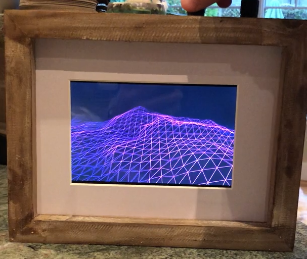
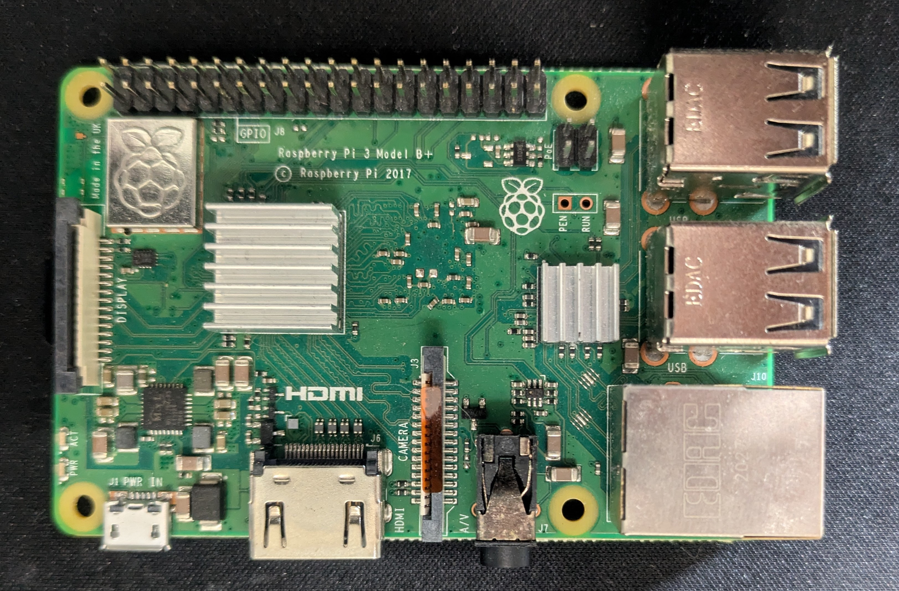
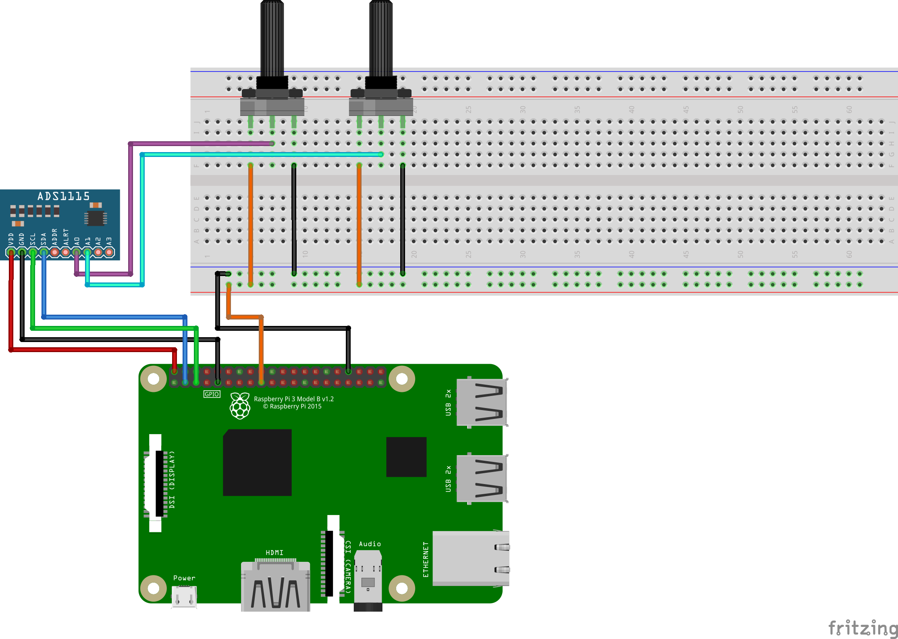
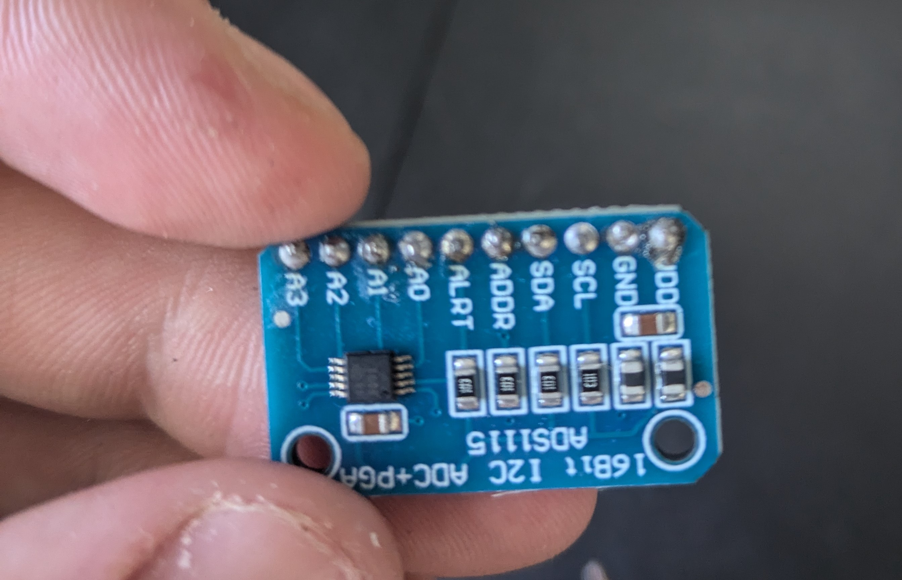
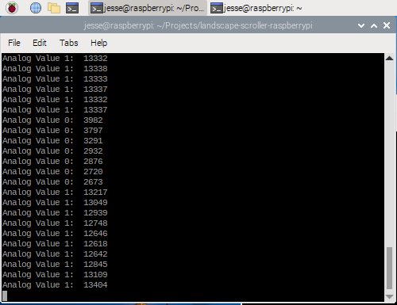

# Landscape Scroller Picture Frame


This project originally came about from a reddit post I came across years ago on r/DidntKnowIWantedThat for a landscape scroller picture frame thing. The original poster u/
ubermonjies provided a few details on the build materials and offered to provide the code but never ended up providing code or instructions.



*Above: From the original reddit post*

I absolutely loved the end result, and have wanted one for myself for years, and so I finally decided to take it upon myself to remake it as best I can. I have included in this readme the entire projects creation process, with project files and scripts all included in the repository.
## Materials

List of Materials:

- x1 Raspberry Pi 3 B+ (Can probably use others, just the one I used)
- x1 MicroSD Card for OS (Raspberry Pi OS 64 bit)
- x2 10k Potentiometers
- x2 Potentiometer knobs
- x1 Raspberry PI 7" touchscreen (Back mounting preferred)
- x1 Picture Frame
- x1 Raspberry Pi 5v Power supply
- x1 ADC (I used ADS1115)
- x1 sheet of white cardstock
- x4 mounting brackets

Other materials and tools used:
- Super glue
- Mounting brackets
- Raspberry Pi standoffs
- Mounting bolts
- Mounting screws
- Breadboard wires
- Soldering gun
- Multimeter

## Raspberry Pi Setup and Wiring

#### Installing Raspberry Pi OS
- Download the Raspberry Pi operating system from https://www.raspberrypi.com/software/
- Can use the Raspberry Pi Imager software to write the OS image to your SD card
- The Imager allows you to preconfigure some settings and setup the Wi-Fi network to connect to once booted.

#### Connecting the Screen

The 7" touchscreen that I ordered came with very simple instructions for connecting the screen to my Raspberry Pi:
- Insert the SD card into the Raspberry Pi with Raspberry Pi OS.
- Install the included brass standoffs into the mounting holes on the back of the touchscreen.
- Connect one end of the included short ribbon cable to the screen.
- Mount your Raspberry Pi to the attached brass standoffs.
- Connect the other end of the ribbon cable to the Raspberry Pi's display connector just on the other side of the SD card reader.
- (Optional) Attach the screen stand to allow the screen + Pi to stand up


*The screen should just display with no configuration needed, if the screen does not display when the Raspberry Pi is booted, try checking if the ribbon cable is properly attached*
#### Mount the Potentiometers
To mount the potentiometers, I used a large drill bit to hollow out a channel in the backside of the picture frame and used a sharp knife to smooth it out for the potentiometers to sit in. I then drilled channels for the potentiometer knob shafts so they would sit above the picture frame.
#### Mount the Pi to the Frame
I cut a rectangle of white cardstock to fit in the picture frame, then measured the screen size (XXmm x XXmm) and cut a rectangular hole in the white cardstock to hide the Pi and its wiring from being seen through the picture frame.

The screen that I chose for the project does not have the display area centered with the screen housing, and so required uneven shimming on both sides as well as the top and bottom to center the display image in the picture frame through the cardstock hole.

After centering the screen, I mounted the display and Pi with some picture frame mounting brackets.
#### Wiring the ADC and Potentiometers


The Raspberry Pi cannot read the analog signals from the signal pin on our two potentiometers, and so the ADC board must be connected to receive the two potentiometer signals.

#### ADS1115 and OSC Setup



In order to read the digital signals from the ADS1115, we will make use of a python script that runs in the background and passes the values to the Processing sketch periodically. The python script will use the adafruit ads1x15 library to read the serial data coming from the ADS1115, and pass the values to the Processing sketch using the OSC protocol.

-  Follow instructions on https://learn.adafruit.com/circuitpython-on-raspberrypi-linux/installing-circuitpython-on-raspberry-pi to install Blinka and create a python virtual environment for running the required python script. *Note: For the virtual environment name I used "scroller"*

- After installation of Blinka into your Python virtual environment, install the ADS1115 CircuitPython library with:

`pip3 install adafruit-circuitpython-ads1x15`

- Then install the Python-osc library for passing the potentiometer values to the Processing sketch:

`pip install python-osc`

## Python Script


- The above script uses a port of 13575 to send the OSC messages to the Processing script, feel free to change this if that specific port does not work for you.
- The loop iterates approximately 30 times per second, which should be more than enough for our application.
- Messages are only passed if the difference between the old and new value is greater than three. This is not really necessary, but helpful for debugging and smoothing out the received values in the Processing sketch.

#### Testing the python script
Assuming that your Raspberry Pi is fully wired and booted, to test the python script make sure that you have the correct virtual environment enabled:
`cd ~`

`source scroller/bin/activate`

`cd` into the Project folder and run the script

`python3 python_server.py`

If the script is working correctly, as you adjust the potentiometer knobs, you should be seeing A0 and A1 values being output to the console as the knobs are rotated:



*Note: If you followed the above wiring diagram you should be seeing values between 0 - ~21600 output to console. This is because I have the potentiometers wired to 3.3v. Potentiometers wired to 5v should see values between 0 - ~32700*

*Note: If the values do not change significantly as the potentiometer knobs are rotated from minimum to maximum rotation, if the values for one or more of the inputs are stuck at some large value (Eg: ~21600), or if one or more of the values appear to change without any rotation - check the wiring to make sure that the potentiometer signal pins have a good connection to the ADS1115 A0 and A1 pins, and that each potentiometer has a solid connection to power and ground.*

*Note: If your script shows high values when at the minimum rotation (fully rotated counter-clockwise) and low values when at maximum, then swap the power and ground wired leading to the potentiometer.*
## Processing Sketch
First we need to install the oscP5 library in Processing in order to receive the messages passed from the python script.

Install oscP5 library through the GUI:
- Tools -> Manage Tools -> Libraries
- Search for "oscP5", select it from the list, and click Install 

This repository includes the full Processing sketch which makes use of many magic numbers. This is the result of lots and lots of tinkering to achieve the look that I was going for to come close to the original. The code is commented as best I can to allow you to more easily modify and tweak it.

## Running it all Together
To run the scroller, several steps are required:

- Activate the python virtual environment

`source scroller/bin/activate`

- Start the python server script

`python3 python-server.py`

- Start the processing sketch. The processing sketch can be run from the command line using the following command:

`PROCESSING-PATH/processing-java --sketch=/SKETCH-PATH/main --run`

*Note:*
*PROCESSING-PATH is the path to where the processing-java executable  is located on your machine. If you downloaded the Processing .tgz file from Processing.org, it may be in your Downloads folder.*
*SKETCH-PATH is the absolute path to the sketch .pde file*

To simplify the startup, we can just put it all in a bash script, adding & to the end of the script and sketch execution to have them run in the background:

```
#! /usr/bin/bash

  

# Activate python environment

cd ~

source scroller/bin/activate

# cd to project directory and run python script

cd ~/Projects/pi-scroller

python python_server.py &

  

# Run Processing sketch

cd ~

./Downloads/processing-4.3/processing-java --sketch=/home/jesse/Projects/pi-scroller/main --run &
```


## Autostart
To make the Pi automatically start the python script and processing sketch at startup, we can just run the above bash script at startup by modifying the autostart file to add a couple extra lines:

`sudo vim /etc/xdg/lxsession/LXDE-pi/autostart`

```
xset s 3600
xset dpms 3600 3600 3600
@reboot ./Projects/pi-scroller/reboot.sh
```


- The first two lines increase the Raspberry Pi screen timeouts to be 1 hour (3600 seconds)
- The third line runs the bash script on reboot

Done - now on reboot the bash script will run, starting the python script as well as the Processing sketch after a few moments.

